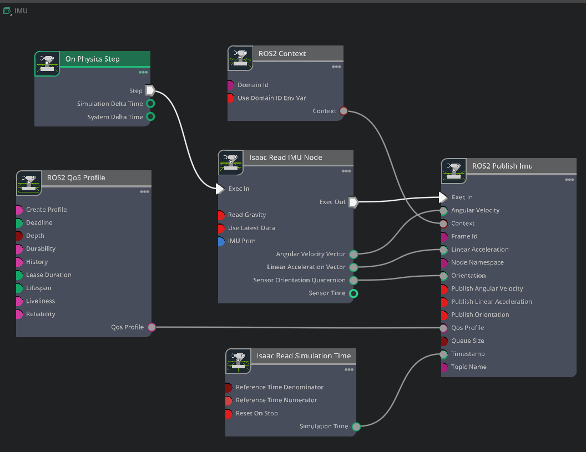
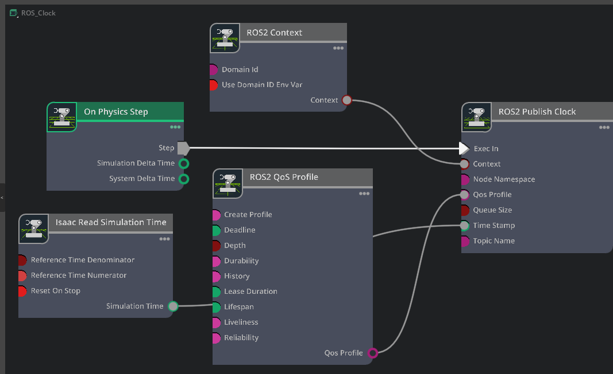
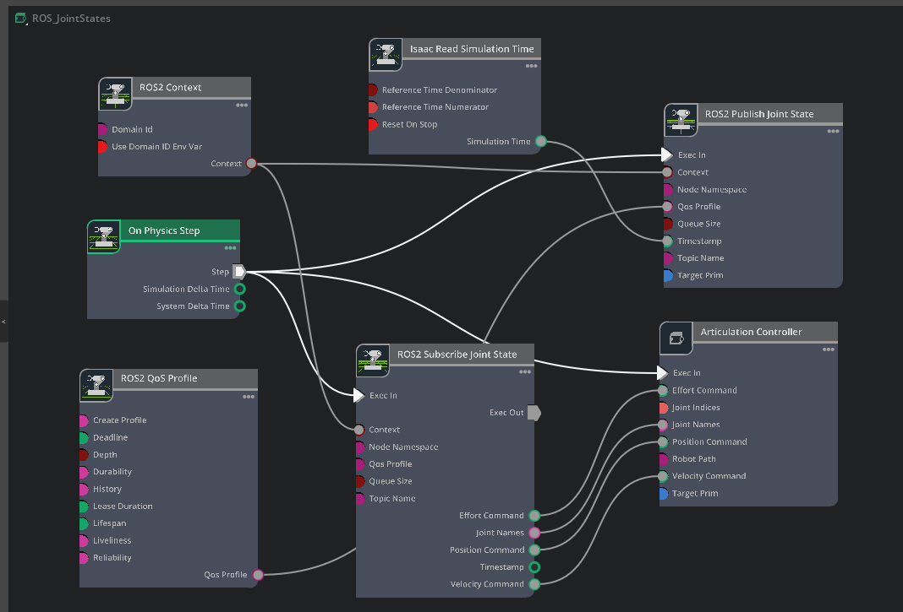
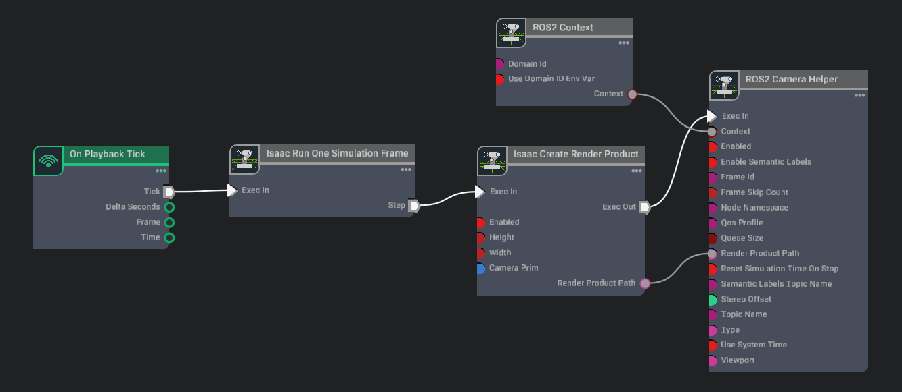
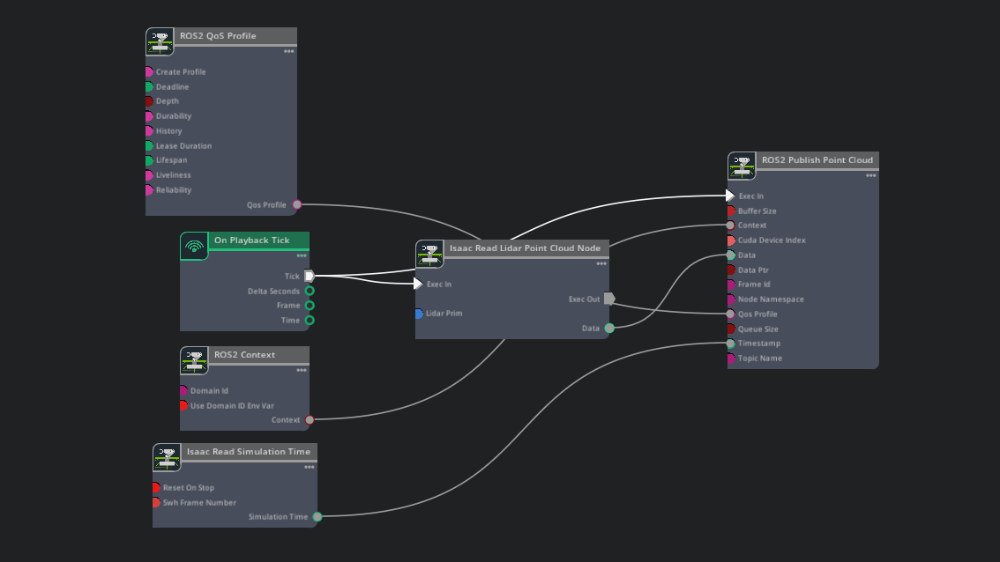

# Isaac Sim Robot Action Graph Examples

This repository collects Isaac Sim Action Graph examples for ROS 2 integration and robot I/O workflows.

## 1. IMU

The IMU action graph publishes IMU sensor data from Isaac Sim to ROS 2. It uses the physics step trigger, ROS 2 context, QoS profile, simulation time, and the IMU publisher node to send the pelvis sensor data through the ROS 2 bridge.

*Figure 1. IMU action graph used to publish IMU data from Isaac Sim to ROS 2.*

See the full description in [IMU/IMU_action_graph.md](IMU/IMU_action_graph.md).

## 2. Clock

The ROS 2 Clock action graph publishes simulation time from Isaac Sim to ROS 2. It is built around the physics step trigger, ROS 2 context, QoS profile, simulation time reader, and clock publisher node.

*Figure 2. ROS 2 Clock action graph used to publish the simulation clock from Isaac Sim.*

See the full description in [ROS2_Clock/ROS2_Clock.md](ROS2_Clock/ROS2_Clock.md).

## 3. Joint State

The Joint State action graph publishes the robot joint states to ROS 2 and subscribes to incoming joint commands. It combines the physics step trigger, ROS 2 context, QoS profile, joint state publisher and subscriber nodes, simulation time, and articulation controller.

*Figure 3. Joint State action graph used to publish and receive joint state data in Isaac Sim.*

See the full description in [JointState_Pub_Sub/ROS2_JointState.md](JointState_Pub_Sub/ROS2_JointState.md).

## 4. Camera

The ROS 2 Camera action graph publishes camera data from Isaac Sim to ROS 2. It uses the playback tick, one simulation frame step, render product creation, ROS 2 context, and camera helper node to stream image data through the ROS 2 bridge.

*Figure 4. ROS 2 Camera action graph used to publish camera output from Isaac Sim.*

See the full description in [ROS2_Camera/ROS2_Camera.md](ROS2_Camera/ROS2_Camera.md).

## 5. 3D Lidar

The ROS 2 3D Lidar action graph publishes simulated Lidar point cloud data from Isaac Sim to ROS 2. It uses the playback tick, ROS 2 context, QoS profile, Lidar point cloud reader, simulation time reader, and point cloud publisher node to send `sensor_msgs/msg/PointCloud2` data through the ROS 2 bridge.

*Figure 5. 3D Lidar action graph used to publish point cloud data from Isaac Sim to ROS 2.*

See the full description in [3D_Lidar/3D_Lidar.md](3D_Lidar/3D_Lidar.md).
