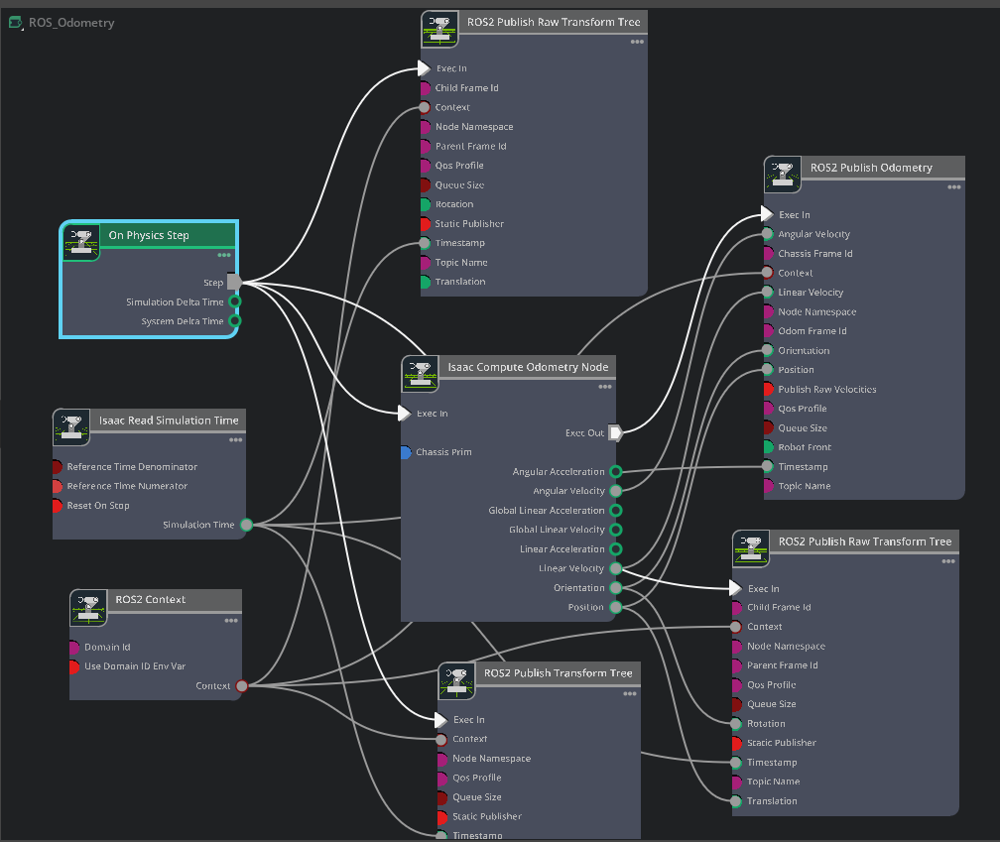

# ROS 2 Odometry and TF Action Graph



*Figure 1. Action graph used to publish robot odometry and the corresponding ROS 2 TF tree from Isaac Sim.*

## Purpose

This action graph publishes ground-truth robot motion from Isaac Sim to ROS 2. It computes the chassis pose and velocity relative to the robot's starting pose, publishes a `nav_msgs/msg/Odometry` message, and broadcasts the transforms required to place the robot and its links in the ROS 2 TF tree.

The core frame relationship is:

```text
world -> odom -> chassis_frame -> robot links
```

Use `base_link` for `chassis_frame` when that is the main body frame in the robot model. A model may instead use a frame such as `base_footprint`; the odometry message and TF publishers must use the same choice consistently.

## Graph Setup

- Create or open an Action Graph and add the nodes shown in Figure 1.
- Set **Isaac Compute Odometry Node** input **Chassis Prim** to the robot prim whose origin represents the odometry pose.
- Configure **ROS2 Publish Odometry** with the desired topic, odometry frame, and chassis frame.
- Configure one **ROS2 Publish Raw Transform Tree** for `odom -> chassis_frame`.
- Configure **ROS2 Publish Transform Tree** to publish the remaining robot links below the chassis frame.
- Add the optional `world -> odom` raw transform only when Isaac Sim should provide ground-truth global localization.
- Enable the ROS 2 bridge and launch Isaac Sim from an environment where the target ROS 2 installation is sourced.

The node property values are not visible in Figure 1, so frame IDs, prim paths, and topic names must be set explicitly in the Property panel.

## Node Overview

- **On Physics Step**: Triggers the graph on every physics update so odometry stays synchronized with robot motion.
- **Isaac Read Simulation Time**: Supplies the simulation timestamp to the odometry and TF publishers.
- **ROS2 Context**: Provides the ROS 2 context shared by all publishers.
- **Isaac Compute Odometry Node**: Computes chassis position, orientation, linear velocity, angular velocity, and acceleration values relative to the initial pose.
- **ROS2 Publish Odometry**: Publishes pose and velocity as `nav_msgs/msg/Odometry`.
- **ROS2 Publish Raw Transform Tree** (`odom -> chassis_frame`): Publishes the transform represented by the computed position and orientation.
- **ROS2 Publish Transform Tree**: Publishes transforms for selected robot prims. When an articulation root is selected, Isaac Sim can publish its articulation links.
- **ROS2 Publish Raw Transform Tree** (`world -> odom`): Optionally anchors the odometry frame to a global frame for ground-truth localization.

## ROS 2 Odometry Message

`ROS2 Publish Odometry` publishes `nav_msgs/msg/Odometry`:

- `header.frame_id`: Set from **Odom Frame Id**. The pose is expressed in this frame.
- `child_frame_id`: Set from **Chassis Frame Id**. The twist is expressed in this frame.
- `pose.pose.position` and `pose.pose.orientation`: Supplied by **Isaac Compute Odometry Node**.
- `twist.twist.linear` and `twist.twist.angular`: Supplied by the computed linear and angular velocities.

The publisher does not expose covariance inputs, so the pose and twist covariance arrays are not estimates from a simulated sensor model. Treat this graph as ground-truth odometry unless noise or an estimator is added elsewhere.

### Velocity Frame

Match **Publish Raw Velocities** to the frame of the connected velocity values. When it is disabled, the publisher projects the supplied world velocities into the robot frame before filling `twist`, whose frame is `child_frame_id`. Enable it only when the connected values are already expressed in the desired chassis frame.

Set **Robot Front** to the robot's forward direction in stage coordinates. Its default is `[1, 0, 0]`. An incorrect value can rotate or change the signs of the published velocity components.

## TF Ownership

ROS TF requires each child frame to have one authoritative parent publisher. For the common mobile-robot layout:

```text
map or world -> odom -> base_link -> sensor and robot links
```

- The odometry source publishes `odom -> base_link`.
- A localization system such as AMCL normally publishes `map -> odom`.
- The robot transform publisher publishes `base_link -> child links`.

Do not publish the optional `world -> odom` transform from Isaac Sim when Nav2, AMCL, SLAM, or another localization node already publishes the corresponding global-to-odometry transform. Competing publishers for the same TF relationship cause jumps and an inconsistent tree.

If the robot starts away from the global origin, configure the optional raw transform's translation and rotation to represent the initial pose. Leaving both disconnected uses the node defaults and makes `world` and `odom` coincide.

## Verify in ROS 2

Press **Play** in Isaac Sim, then run these commands in a sourced ROS 2 terminal:

```bash
ros2 topic list
ros2 topic info /odom -v
ros2 topic hz /odom
ros2 topic echo /odom --once
ros2 run tf2_ros tf2_echo odom base_link
ros2 run tf2_tools view_frames
```

Check that:

- `/odom` uses `odom` as `header.frame_id`.
- `child_frame_id` matches the chassis frame, such as `base_link`.
- The pose changes smoothly as the robot moves.
- `odom -> base_link` in `/tf` agrees with the pose in `/odom`.
- Every robot link has only one parent in the generated TF tree.

To inspect the result in RViz2, set **Fixed Frame** to `odom`, `map`, or `world`, depending on which global transforms are available, then add **TF** and **Odometry** displays.

## Isaac Sim Version Note

Figure 1 follows the Isaac Sim 4.5-style workflow, where **ROS2 Publish Transform Tree** computes transforms directly from **Target Prims**. In the Isaac Sim 6.0 Early Developer Release documentation available on June 11, 2026, NVIDIA also shows a decoupled workflow in which **Isaac Compute Transform Tree** feeds frame, translation, and orientation arrays into **ROS2 Publish Transform Tree**. Follow the node inputs and TF tutorial for the installed Isaac Sim version; the publisher API currently documents both direct target prims and precomputed transform arrays.

The odometry path remains conceptually the same: compute chassis odometry, publish `/odom`, and publish the matching `odom -> chassis_frame` transform.

## Troubleshooting

- **No `/odom` topic**: Confirm the ROS 2 bridge is enabled, the timeline is playing, and the ROS domain ID matches other ROS 2 processes.
- **Pose remains zero**: Check **Chassis Prim** and verify that the selected prim moves with the robot.
- **TF lookup fails**: Ensure the raw TF frame IDs exactly match the odometry frame IDs and that all publishers use simulation timestamps.
- **Robot appears twice or jumps in RViz2**: Look for duplicate publishers of `odom -> base_link` or `map/world -> odom`.
- **Child links are missing**: Set the correct articulation root or explicitly add the required links to **Target Prims**.
- **Timestamps do not match sensor data**: Feed **Isaac Read Simulation Time** to every publisher and publish `/clock` for ROS 2 nodes configured with `use_sim_time`.

## References

- NVIDIA Isaac Sim 6.0: [ROS2 Transform Trees and Odometry tutorial](https://docs.isaacsim.omniverse.nvidia.com/latest/ros2_tutorials/tutorial_ros2_tf.html)